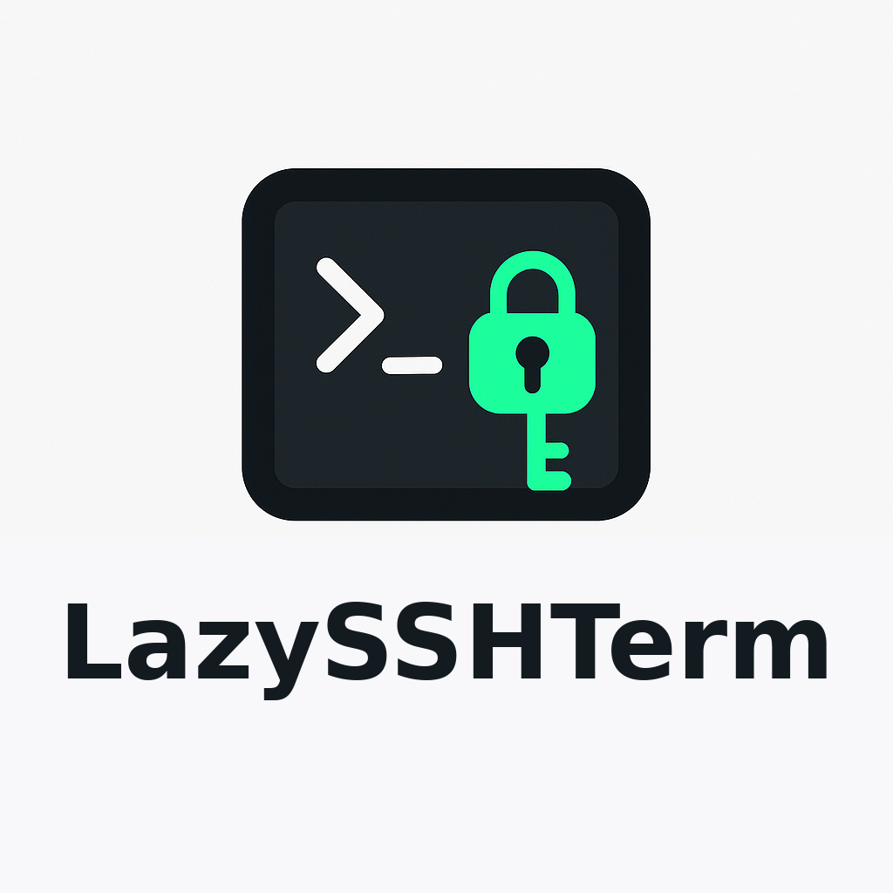

<div align="center">
  
</div>

---

lazysshterm is a terminal-based, interactive SSH manager inspired by tools like lazydocker and k9s — but built for managing your fleet of servers directly from your terminal.
<br/>
With lazysshterm, you can quickly navigate, connect, manage, and transfer files between your local machine and any server defined in your `~/.ssh/config`. No more remembering IP addresses or running long scp commands — just a clean, keyboard-driven UI.

A standalone fork of [lazyssh](https://github.com/adembc/lazyssh): connections, shell sessions, and port forwarding run on a native Go SSH client — no system `ssh`/`ssh.exe` binary required, Linux and Windows alike.

---

## ✨ Features

### Server Management
- 📜 Read & display servers from your `~/.ssh/config` in a scrollable list.
- ➕ Add a new server from the UI with comprehensive SSH configuration options.
- ✏ Edit existing server entries directly from the UI with a tabbed interface.
- 🗑 Delete server entries safely.
- 📌 Pin / unpin servers to keep favorites at the top.
- 🏓 Ping server to check status.

### Quick Server Navigation
- 🔍 Fuzzy search by alias, IP, or tags.
- 🖥 One‑keypress SSH into the selected server (Enter).
- 🏷 Tag servers (e.g., prod, dev, test) for quick filtering.
- ↕️ Sort by alias or last SSH (toggle + reverse).

### Advanced SSH Configuration
- 🔗 Port forwarding (LocalForward, RemoteForward, DynamicForward/SOCKS5).
- 🚀 Multi-hop ProxyJump, resolved through your `~/.ssh/config` aliases.
- 🔐 Public key, ssh-agent, and password authentication.
- 🔒 Trust-on-first-use host key verification against `~/.ssh/known_hosts`.
- ⚙️ Extensive SSH config options organized in a tabbed interface.

### Key Management
- 🔑 SSH key autocomplete with automatic detection of available keys.
- 📝 Smart key selection with support for multiple keys, including encrypted (passphrase-protected) keys.

### Upcoming
- 📁 Copy files between local and servers with an easy picker UI.
- 🔑 SSH Key Deployment Features:
    - Use default local public key (`~/.ssh/id_ed25519.pub` or `~/.ssh/id_rsa.pub`)
    - Paste custom public keys manually
    - Generate new keypairs and deploy them
    - Automatically append keys to `~/.ssh/authorized_keys` with correct permissions
---

## 🔐 Security Notice

lazysshterm does not introduce any new security risks.
It is simply a UI/TUI wrapper around your existing `~/.ssh/config` file.

- All SSH connections run through a native Go SSH client (`golang.org/x/crypto/ssh`) built into lazysshterm — no dependency on a system `ssh`/`ssh.exe` binary, so it works the same on Linux and Windows.

- Host keys are verified against your `~/.ssh/known_hosts` (trust-on-first-use for new hosts, hard rejection on a mismatch) — the same protection real `ssh` gives you.

- Private keys, passwords, and credentials are never stored, transmitted, or modified by lazysshterm. Passphrases and passwords are only held in memory for the duration of a connection attempt.

- Your existing IdentityFile paths and ssh-agent integrations work exactly as before.

- lazysshterm only reads and updates your `~/.ssh/config`. A backup of the file is created automatically before any changes.

- File permissions on your SSH config are preserved to ensure security.


## 🛡️ Config Safety: Non‑destructive writes and backups

- Non‑destructive edits: lazysshterm only writes the minimal required changes to your ~/.ssh/config. It uses a parser that preserves existing comments, spacing, order, and any settings it didn't touch. Your handcrafted comments and formatting remain intact.
- Atomic writes: updates are written to a temporary file and then atomically renamed over the original, minimizing the risk of partial writes.
- Backups:
  - One‑time original backup: before lazysshterm makes its first change, it creates a single snapshot named config.original.backup beside your SSH config. If this file is present, it will never be recreated or overwritten.
  - Rolling backups: on every subsequent save, lazysshterm also creates a timestamped backup named like: ~/.ssh/config-<timestamp>-lazysshterm.backup. The app keeps at most 10 of these backups, automatically removing the oldest ones.

## 📷 Screenshots

<div align="center">

### 🚀 Startup


Clean loading screen when launching the app

---

### 📋 Server Management Dashboard


Main dashboard displaying all configured servers with status indicators, pinned favorites at the top, and easy navigation

---

### 🔎 Search


Fuzzy search functionality to quickly find servers by name, IP address, or tags

---

### ➕ Add/Edit Server


Tabbed interface for managing SSH connections with extensive configuration options organized into:
- **Basic** - Host, user, port, keys, tags
- **Connection** - Proxy, timeouts, multiplexing, canonicalization
- **Forwarding** - Port forwarding, X11, agent
- **Authentication** - Keys, passwords, methods, algorithm settings
- **Advanced** - Security, cryptography, environment, debugging

---

### 🔐 Connect to server


SSH into the selected server

</div>

---

## 📦 Installation

### Option 1: go install (Recommended)

Requires [Go](https://go.dev/dl/) 1.24+. Installs straight from source, no separate download step:

```bash
go install github.com/btafoya/lazysshterm/cmd/lazysshterm@latest
lazysshterm
```

Make sure `$(go env GOPATH)/bin` (or `$GOBIN`) is on your `PATH`. This builds a native SSH client binary — no system `ssh`/`ssh.exe` needed at runtime, Linux and Windows alike. Note: `go install` doesn't stamp a version/commit, so `--version`-style output will show as a dev build; use one of the options below if you need a versioned release binary.

### Option 2: Download Binary from Releases

Download from [GitHub Releases](https://github.com/btafoya/lazysshterm/releases). You can use the snippet below to automatically fetch the latest version for your OS/ARCH (Linux and Windows, amd64/arm64 supported):

```bash
# Detect latest version
LATEST_TAG=$(curl -fsSL https://api.github.com/repos/btafoya/lazysshterm/releases/latest | jq -r .tag_name)
# Download the correct binary for your system
curl -LJO "https://github.com/btafoya/lazysshterm/releases/download/${LATEST_TAG}/lazysshterm_$(uname)_$(uname -m).tar.gz"
# Extract the binary
tar -xzf lazysshterm_$(uname)_$(uname -m).tar.gz
# Move to /usr/local/bin or another directory in your PATH
sudo mv lazysshterm /usr/local/bin/
# enjoy!
lazysshterm
```

### Option 3: Build from Source

```bash
# Clone the repository
git clone https://github.com/btafoya/lazysshterm.git
cd lazysshterm

# Build (native SSH client — no system ssh binary needed at runtime)
make build
./bin/lazysshterm

# Or Run it directly
make run

# Cross-compile for Windows
GOOS=windows GOARCH=amd64 go build -o lazysshterm.exe ./cmd/lazysshterm
```

Windows binaries carry an embedded application icon (built from `docs/logo.png` via `make icon`). Linux users who want the icon in an app launcher can copy `packaging/linux/lazysshterm.desktop` to `~/.local/share/applications/` and `packaging/linux/icons/lazysshterm.png` to `~/.local/share/icons/hicolor/256x256/apps/lazysshterm.png`.

---

## ⌨️ Key Bindings

| Key   | Action                        |
| ----- | ----------------------------- |
| /     | Toggle search bar             |
| ↑↓/jk | Navigate servers              |
| Enter | SSH into selected server      |
| c     | Copy SSH command to clipboard |
| g     | Ping selected server          |
| r     | Refresh background data       |
| a     | Add server                    |
| e     | Edit server                   |
| t     | Edit tags                     |
| d     | Delete server                 |
| p     | Pin/Unpin server               |
| s     | Toggle sort field             |
| S     | Reverse sort order             |
| q     | Quit                          |

**In Server Form:**
| Key    | Action               |
| ------ | -------------------- |
| Ctrl+H | Previous tab         |
| Ctrl+L | Next tab             |
| Ctrl+S | Save                 |
| Esc    | Cancel               |

Tip: The hint bar at the top of the list shows the most useful shortcuts.

---

## 🤝 Contributing

Contributions are welcome!

- If you spot a bug or have a feature request, please [open an issue](https://github.com/btafoya/lazysshterm/issues).
- If you'd like to contribute, fork the repo and submit a pull request ❤️.

### Semantic Pull Requests

This repository enforces semantic PR titles via an automated GitHub Action. Please format your PR title as:

- type(scope): short descriptive subject
Notes:
- Scope is optional and should be one of: ui, cli, config, parser.

Allowed types in this repo:
- feat: a new feature
- fix: a bug fix
- improve: quality or UX improvements that are not a refactor or perf
- refactor: code change that neither fixes a bug nor adds a feature
- docs: documentation only changes
- test: adding or refactoring tests
- ci: CI/CD or automation changes
- chore: maintenance tasks, dependency bumps, non-code infra
- revert: reverts a previous commit

Examples:
- feat(ui): add server pinning and sorting options
- fix(parser): handle comments at end of Host blocks
- improve(cli): show friendly error when a host key can't be verified
- refactor(config): simplify backup rotation logic
- docs: add installation instructions
- ci: cache Go toolchain and dependencies

Tip: If your PR touches multiple areas, pick the most relevant scope or omit the scope.

---

## 🙏 Acknowledgments

- A fork of [lazyssh](https://github.com/adembc/lazyssh) by [adembc](https://github.com/adembc) — the server management UI, config parsing, and overall design originate there.
- Built with [tview](https://github.com/rivo/tview), [tcell](https://github.com/gdamore/tcell), and [golang.org/x/crypto](https://pkg.go.dev/golang.org/x/crypto/ssh) for the native SSH client.
- Inspired by [k9s](https://github.com/derailed/k9s) and [lazydocker](https://github.com/jesseduffield/lazydocker).
